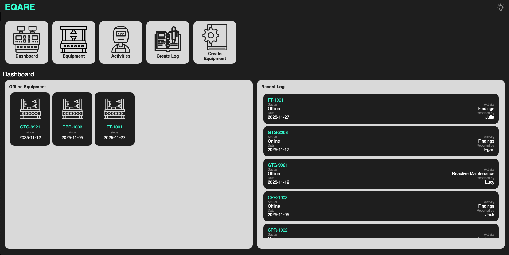
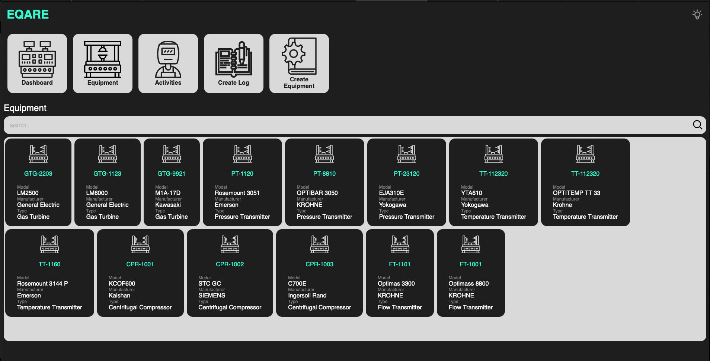
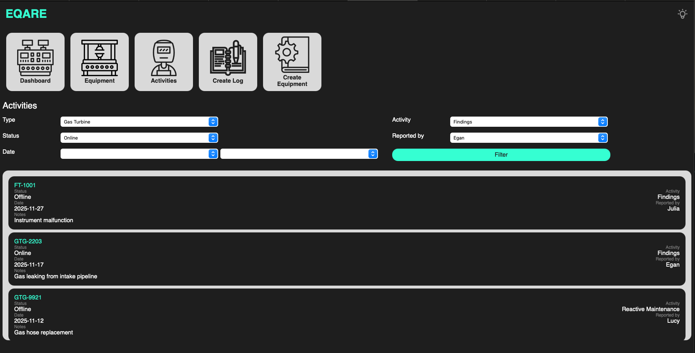
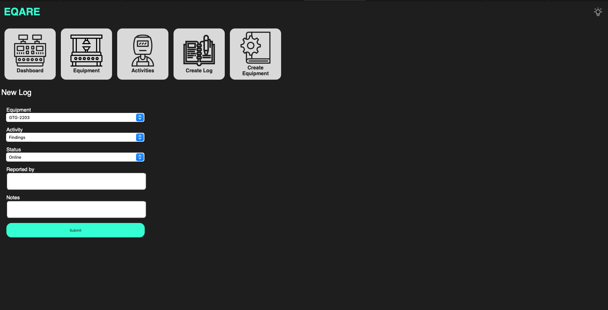
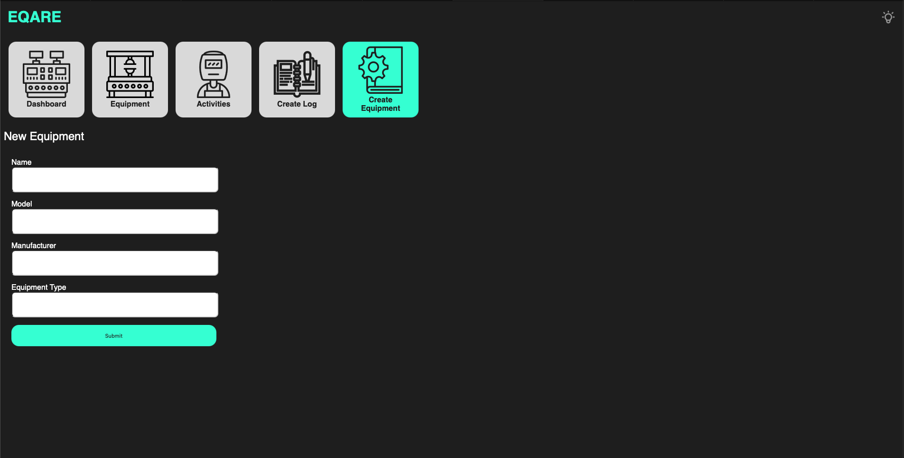

# EQARE - Equipment Care Database

Small PHP + SQLite web app for managing equipment.

## Tech stack

- PHP 
- SQLite (`eqare.db`)
- HTML + CSS

## Screenshots

### Dashboard

### Equipments List

### Activities
Logged data 

### Create Log

### Create Equipment

